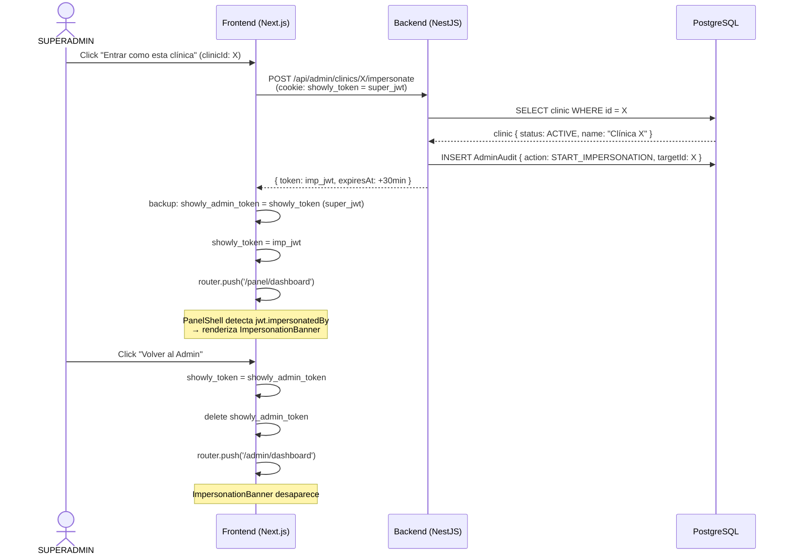

# 2026-08-14 — Impersonation flow: cookies, redirects y edge cases

Nota técnica que complementa [[adr/0014-superadmin-como-operador-saas]]. Describe el flujo completo de impersonation — desde el click en el panel admin hasta la restauración de la sesión original — incluyendo el manejo de cookies y los casos borde que hay que cubrir en la implementación.

## Diagrama de flujo



## Estructura del JWT impersonado

```json
{
  "sub": "uuid-del-superadmin",
  "role": "CLINIC_ADMIN",
  "clinicId": "uuid-de-la-clinica-X",
  "impersonatedBy": "uuid-del-superadmin",
  "exp": 1755187200
}
```

El claim `impersonatedBy` es la señal que usa `PanelShell` para mostrar el banner. Los guards leen `clinicId` del JWT normalmente — no saben ni les importa si es impersonation.

## Edge cases

### JWT impersonado expira mientras el super está activo

El token dura 30 minutos. Si expira durante la sesión, la próxima request autenticada recibe 401. El frontend (interceptor de Axios/fetch) debe detectar el 401 + presencia de `showly_admin_token` y **restaurar automáticamente la sesión original** en vez de redirigir al login. Flujo de recuperación automática:

1. Request → 401.
2. Interceptor: ¿existe `showly_admin_token`?
   - Sí → restaurar `showly_token`, borrar `showly_admin_token`, redirect a `/admin/dashboard` con toast "Tu sesión de impersonation expiró".
   - No → redirect a `/login` (flujo normal de sesión expirada).

### Super cierra la pestaña sin hacer click en "Volver al Admin"

El `showly_admin_token` queda en la cookie. La próxima vez que el super abra el panel, el middleware detecta que `showly_token` tiene `impersonatedBy` seteado y que hay `showly_admin_token`. Opciones:
- **Opción A (implementada)**: restaurar automáticamente al super en el primer render de `/panel/*` si el token de impersonation ya expiró.
- **Opción B**: mostrar un modal de "Tu última sesión era de impersonation — ¿querés volver al admin?".

Recomendado: Opción A para MVP (menos fricción, más claro).

### Super abre dos pestañas e impersona clínicas distintas

Las cookies son compartidas entre pestañas del mismo origen. La segunda impersonation sobreescribe `showly_token` y `showly_admin_token` de la primera. El backup de la primera sesión de impersonation se pierde. Para MVP esto es aceptable — documentar en el banner: "No abrir múltiples sesiones de impersonation simultáneas".

### Clínica suspendida durante la impersonation

Si la clínica pasa a `SUSPENDED` mientras el super la está impersonando, el JWT sigue siendo válido hasta que expire (30 min). Los guards validan el JWT pero no hacen lookup de `clinic.status` en cada request (sería demasiado caro). El bloqueo por status ocurre solo en `login()`. Consecuencia: el super puede seguir operando en una clínica que él mismo acaba de suspender durante esos 30 min. **Aceptable** — el super tiene el control total; no es un vector de ataque.

### Impersonation de una clínica ARCHIVED

`POST /admin/clinics/:id/impersonate` debe verificar `status === 'ACTIVE'`. Si la clínica está `ARCHIVED`, devolver 422 con mensaje "No se puede impersonar una clínica archivada". Esto evita que el super opere sobre datos en estado de soft-delete accidentalmente.
