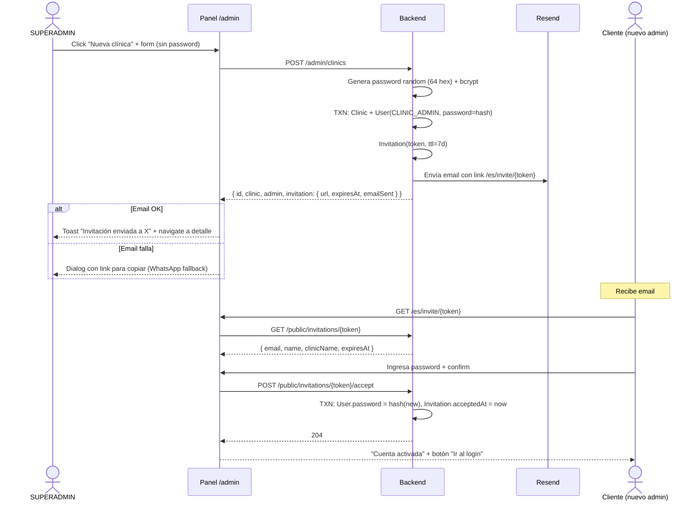

# 2026-08-14 — Invitation flow para creación de clínicas

Nota técnica sobre el reemplazo del "crear clínica + password en claro" por un flujo de invitación con magic link. Complementa [[adr/0014-superadmin-como-operador-saas]] y su fase de onboarding.

## Motivación

La primera versión de `POST /admin/clinics` recibía `admin.plainPassword` desde el UI, hasheaba con bcrypt y persistía. Aceptable para MVP pero:

- La password ingresada por el super quedaba en el request → response JSON → toast del UI → potencial log del proxy → memoria del navegador del super. Difícil de auditar y rotar.
- Enviar por email era peor: quedaba también en logs de Resend + servidor SMTP + inbox del cliente.
- El cliente no elige su propia contraseña — recibe una del super, tiene que rotarla, no la rota.

Solución estándar SaaS: **invitation link**. Notion, Linear, Vercel, GitHub — todos lo hacen así.

## Diseño

### Modelo

```prisma
model Invitation {
  id              String    @id @default(cuid())
  token           String    @unique @db.VarChar(64)   // 32 bytes hex random
  userId          String    @unique                   // 1:1 con User
  invitedByUserId String?                             // SUPERADMIN que envió
  expiresAt       DateTime
  acceptedAt      DateTime?                           // NULL = pendiente
  createdAt       DateTime  @default(now())
}
```

- 1:1 con User: solo una invitación pendiente por user. Reenviar = borrar la vieja + crear una nueva.
- Token de 64 chars hex (~256 bits entropía). Impracticable de fuerza bruta.
- TTL default 7 días (`INVITATION_TTL_DAYS`).

### Endpoints públicos

- `GET /api/public/invitations/:token` — devuelve `{email, invitedName, clinicName, expiresAt}`. 404 si no existe, 410 si aceptada o expirada.
- `POST /api/public/invitations/:token/accept` — body `{plainPassword}` (min 8). Hashea + asigna al User + marca `acceptedAt` en una transacción. 204 No Content al éxito, 410 en re-intento (idempotencia).

Rate-limits (por IP):
- GET: 30/min
- POST accept: 10/min

### Flujo de creación



### Email

Template en `apps/backend/src/mail/templates/clinic-invitation.template.ts`:
- HTML self-contained (inline styles, sin `<link>`).
- Plaintext paralelo (obligatorio para no ir a spam).
- Localizado en `es` (LATAM neutro) y `pt` (Brasil).
- Brand tokens hardcoded (navy `#0F2A4A` / teal `#28D9B9`).

### Dev fallback

Si `RESEND_API_KEY` no está seteada, `MailService` loguea el intento y devuelve `{ok:true, messageId:null}`. Motivo: durante dev queremos que la creación funcione end-to-end sin exigir API key. El super ve el link en el response de todas maneras (`invitation.url`).

### Fallback si el email falla en prod

El `AdminClinicsService.create()` NO tira si el mail falla — la clínica ya se creó, no tiene sentido revertir todo. El response incluye `invitation.emailSent: false` cuando pasa. El UI abre un dialog secundario mostrando la URL en un input readonly con botón "Copiar" para que el super la pase por otro canal (WhatsApp).

## Endpoints e2e verificados

Con curl:

```bash
# 1. Super loguea
SUPER_TOKEN=$(curl -X POST /api/auth/login ...)

# 2. Crea clínica → recibe invitation.url
curl -X POST /api/admin/clinics -H "Authorization: Bearer $SUPER_TOKEN" -d '...'
# → 200 con invitation.url

# 3. Cliente GET invite
curl /api/public/invitations/{token}
# → 200 con info safe

# 4. Cliente accept
curl -X POST /api/public/invitations/{token}/accept -d '{"plainPassword":"..."}'
# → 204

# 5. Cliente login con nueva password
curl -X POST /api/auth/login -d '{"email":"...","password":"..."}'
# → 200

# 6. Cliente re-accept (idempotencia)
curl -X POST /api/public/invitations/{token}/accept -d '{"plainPassword":"..."}'
# → 410 Gone
```

## Env vars nuevas

```
RESEND_API_KEY=""                                # opcional en dev
EMAIL_FROM="Showly <onboarding@resend.dev>"      # dominio verificado en prod
APP_BASE_URL="http://localhost:3002"             # para armar link absoluto
```

## Pendientes

- **Reenviar invitación** desde el detalle de la clínica en `/admin/clinics/:id` — endpoint `POST /admin/invitations/:userId/resend` que borra la vieja y crea nueva + reenvía email. Útil cuando el email se perdió o expiró antes de que el cliente entre.
- **Endpoint `POST /admin/users`** para invitar admins adicionales a una clínica existente (fase 2 — MVP solo invita al primer admin).
- **Rotación**: si un user pide "olvidé mi contraseña", reusar el mismo mecanismo con una `Invitation` marcada como reset (agregar campo `kind: INVITE | RESET`).
